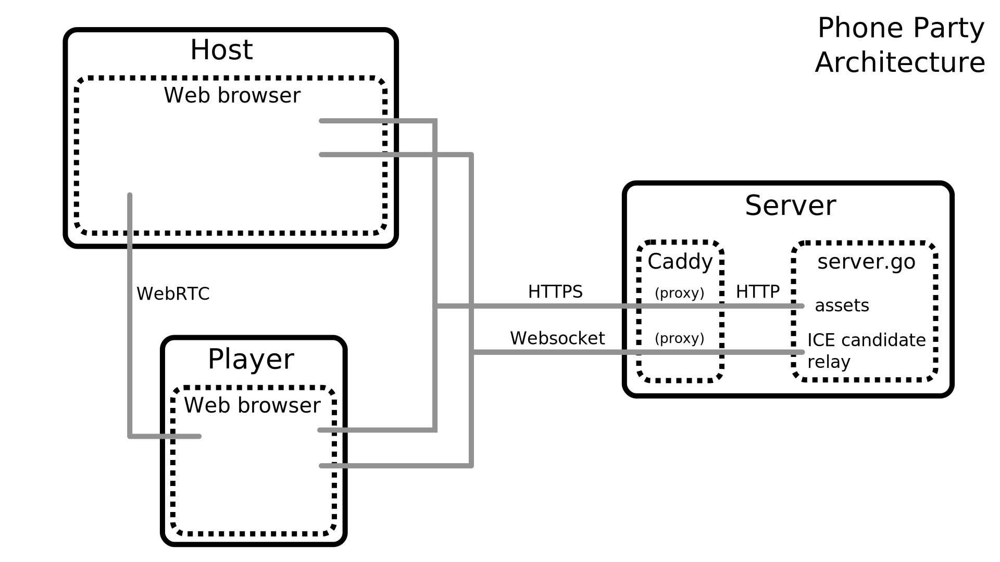
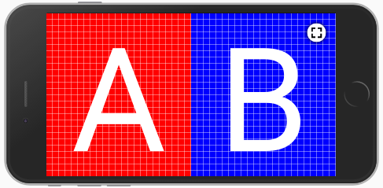
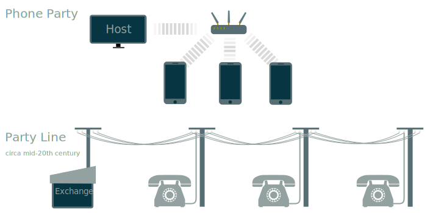

# Phone Party

Instant-join mobile party games over wifi.

Phone party is a web framework for multiplayer party games. Each player connects by visiting a web address on their own device, and the game is coordinated by a host device with a larger shared screen.

The emphasis is on zero-setup instant fun:

- Join a game just by going to a web address; no app download.
- Front-facing cameras identify each player; they don't have to enter a username.
- Instant loading; simple vector/procedural graphics mean no significant amount of data for game assets.

## Usage

Phone Party is a [Go Module](https://github.com/golang/go/wiki/Modules). The [go run](https://golang.org/cmd/go/#hdr-Compile_and_run_Go_program) command can install dependencies and run the server locally:

```bash
$ cd phoneparty/
$ go run . --serve_address :8080
```

- Try the sandbox at http://localhost:8080/sandbox
- Host a game at http://localhost:8080/host
- Join as a player at http://localhost:8080

## Tech

- [WebRTC](https://developer.mozilla.org/en-US/docs/Web/API/WebRTC_API), for streaming video from selfie cameras and relaying button presses etc.
- [Websockets](https://developer.mozilla.org/en-US/docs/Web/API/WebSockets_API), for brokering WebRTC connections.
- [WebGL](https://developer.mozilla.org/en-US/docs/Web/API/WebGL_API) for some intro graphics.
- The [Web Audio API](https://developer.mozilla.org/en-US/docs/Web/API/Web_Audio_API), for beeps and boops.
- The [Sensor APIs](https://developer.mozilla.org/en-US/docs/Web/API/Sensor_APIs) for using accelerometer data.

## Architecture



WebRTC is used to make direct connections between the players and the host web browser. The server is used only to negotiate WebRTC connections and serve HTML and other assets.

## Codebase

Just as Phone Party aims to have a zero-setup, 'instant' experience for users, so too does it aim to have a zero-setup developer experience. This means:

- No JS/CSS build process. Assets can be edited in-place without file watching and rebuilding; just reload the browser.
- Zero client-side dependencies. npm/yarn not required.
- No transpilation or minification. Source-maps are not needed, and there's no difference between production and locally running code.
- No bundling. The DevTools source tree just mirrors the repo. HTTP/2 server push ensures efficient loading.

Javascript language features are used conservatively such that code will run directly on browsers without Babel. Only relatively modern browser versions are supported anyway, as WebRTC is a base requirement.

## Panels




A two-panel system is available for easily laying out controls on mobile devices in landscape or portrait orientation. Either panel can independently have controls added or removed, with empty panels sliding away off-screen.

## Name



Phone Party gets its name partly from the "party line" configuration used for early commercial telephone circuits. In this configuration, the same telephone circuit would be shared with multiple subscribers. Everyone on the line would hear everyone else, with the exchange coordinating.
