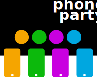

# Phone Party

A framework for party games, where each player connects using their phone and plays together on a shared screen. It's designed so that anyone with a phone connected to the same wifi can extremely quickly and easily join in to the game by just going to a web address. Setting up a username is unnecessary because the front facing camera is used to identify the player.

## Tech

- [WebRTC](https://developer.mozilla.org/en-US/docs/Web/API/WebRTC_API), for streaming video from selfie cameras and relaying button presses etc.
- [Websockets](https://developer.mozilla.org/en-US/docs/Web/API/WebSockets_API), for brokering WebRTC connections.
- The [Web Audio API](https://developer.mozilla.org/en-US/docs/Web/API/Web_Audio_API), for beeps and boops.
- The [Sensor APIs](https://developer.mozilla.org/en-US/docs/Web/API/Sensor_APIs) for using accelerometer data.

## Architecture


WebRTC is used to make direct connections between the players and the host web browser. The server is used only to negotiate WebRTC connections and serve HTML and other assets.

## Usage

For a locally running demo:

*Requies [Go](https://golang.org/)

```bash
# Requires websocket library
$ go get github.com/gorilla/websocket

# serves on port 8080
$ go run server.go
```

- Host a game at http://localhost:8080/host
- Join as a player at http://localhost:8080

**Note:** this will only work when opening browser tabs on the same machine, and video streaming is not allowed because of the lack of HTTPS. For multiplayer over WIFI with video streaming, an HTTPS-enabled proxy server (like [Caddy](https://caddyserver.com/)) must be used.
